# Serial Tool "deBUGger"
> Open source serial terminal optimized for testing embedded devices

## Table of Contents
1. What is deBUGger?
2. Installation and Start Up
3. deBUGger Walkthrough
4. Modifying the Source Code
5. Contact Info

## 1. What is deBUGger?
Serial is a common method of communication for embedded systems and IOT products from desktop computers. The deBUGger GUI removes the repetitive work of setting serial setting and writing data bytes by saving this information into json profiles. Other key features of this program are summarized below.
- Scan for serial devices (COM ports)
- Converting from HEX, DEC, ASCII
- Automatically send all serial command in a list.
- Write serial log to files
> Note: deBUGger is only supported on Windows, sorry MAC and Linux users.

"deBUGger" is an open source program, meaning you are free to modify the program and add additional features. See section 4 for more details on modifying the Python source code.

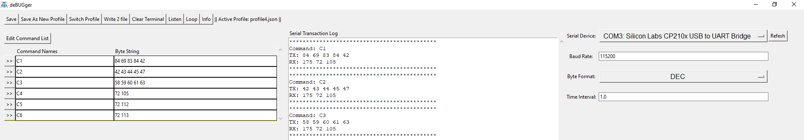

## 2. Installation and Start Up
deBUGger can be installed in two ways, via downloading the zip, or cloning the repository. If you have no interest in modifying the source code and wont be using git tracking, then the zip download is the simplest option. Both the http link for Git cloning and the "download zip" button are available under the "code button" on the repo page.
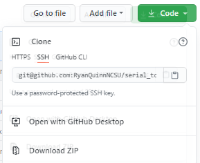

After either cloning or downloading the project, open the "EXE" directory. There you will find the "deBUGger" executable. Double click to start the program.

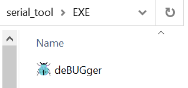

After a few seconds of loading the GUI should appear on the screen as shown below.

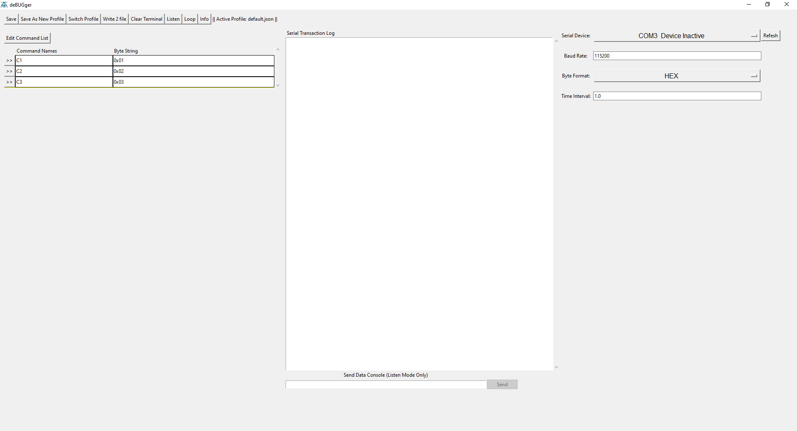

Now you are ready to start using deBUGger for serial communication.

> Note: For best viewing experience have your display zoom set to 100% (On Win 10: settings->display->scale and layout). If the GUI looks like portions are cropped out, be sure to check this setting.

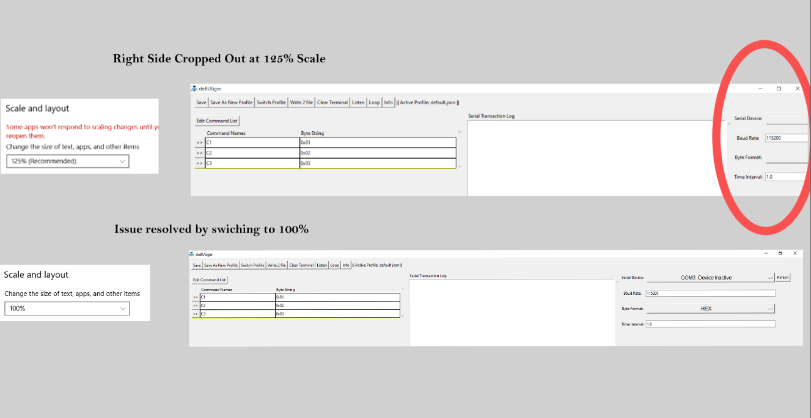

## 3. deBUGger Walkthrough:
This section will provide a walkthrough on how to use deBUGger. The program GUI is broken into 4 sections.

1. Action Buttons:
> Used to save and load serial settings (profiles) to GUI. Also control other serial modes and features.

2. Serial Command List:
> An editable list of serial commands (byte arrays).

3. Serial Transaction Log:
> A terminal showing the bytes transmitted and received over serial.

4. Serial Settings:
> A menu for configuring serial communication settings.  

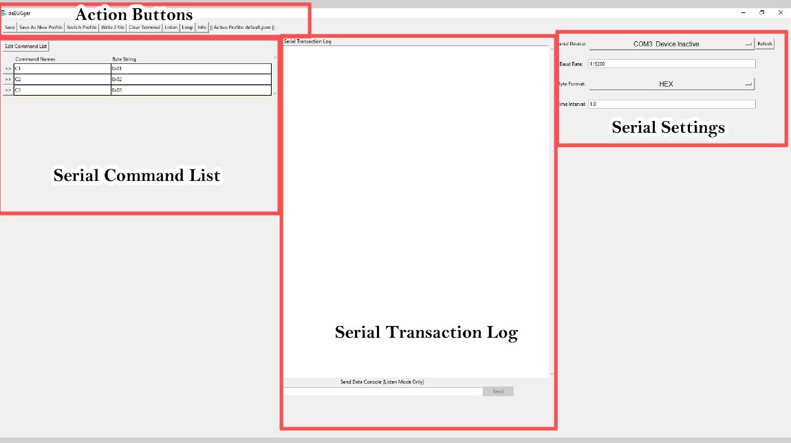

### Serial Communication:

Now lets walkthrough basic serial communication using the deBUGger. For the purposes of this walkthrough I am going to use a USB to UART bridge with the RX and TX pins connect by a jumper. Meaning any bytes I send over the serial device will be sent back to my PC.

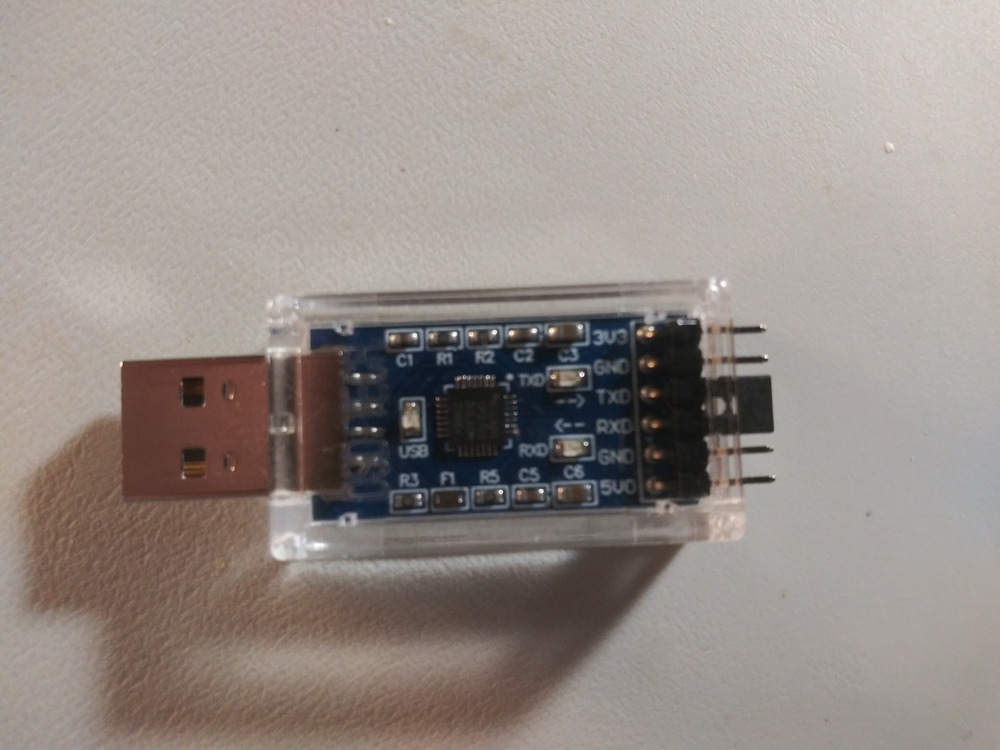

To begin serial communication, first we need to select the serial device in the Serial Settings section of the GUI. Start by clicking the refresh button to search for serial devices plugged into your computer.

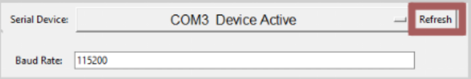

Next click on the drop down menu to reveal the device list. For this example I will select the USB to UART Bridge on COM3.

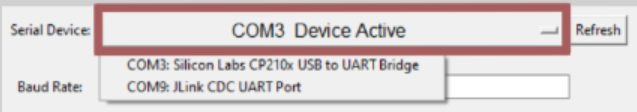

After the serial device has been selected, make sure to set the other serial settings to meet your needs. These other settings include the baud rate, byte format (hex,dec,ascii), and the time interval (how long to listen for a serial response after sending a command).

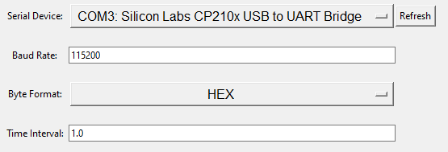

With serial configuration complete, it is now time to start sending serial commands. The first time you open deBUGger a few default serial commands will be provided for you in the command list section. Pressing the ">>" (play) button next to each command will send the command to your chosen serial device.

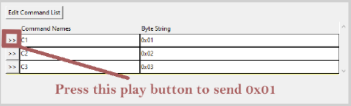

The commands you send over serial can bee seen in the serial transaction log in the middle of the GUI. This log will also show any serial responses before the serial timeout, defined by the time interval setting.

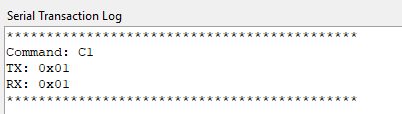

The serial transaction log can be written to a file or cleared by using corresponding action buttons.

 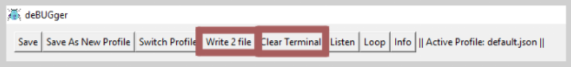

Rather than send each command individually, press the "Loop" button (located in the action buttons section) to run though all the commands in the command list. The loop button will send commands in the order they appear, with time interval separating sending each command.

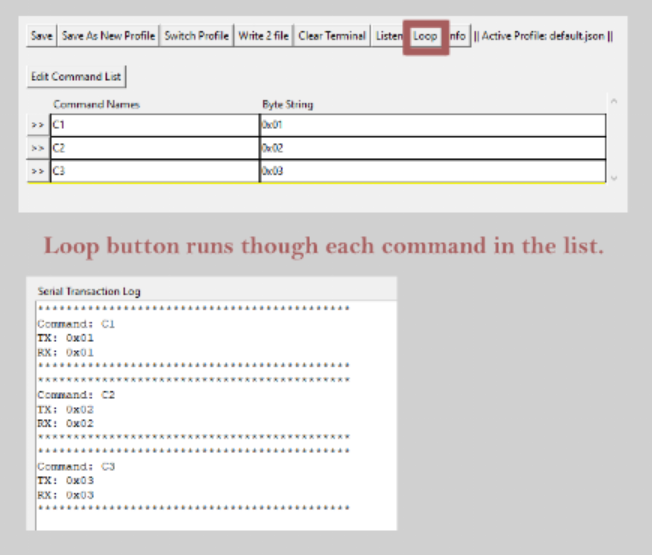

To modify the command list, press on the "Edit Commands List" button. This will open a new window where commands can be added or removed.

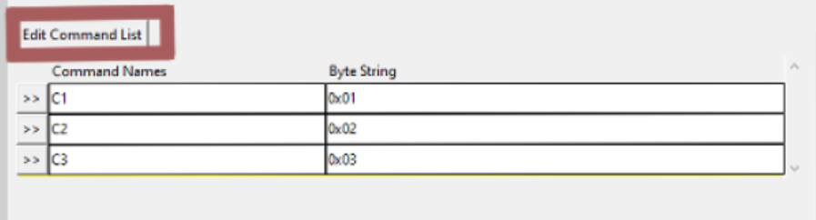
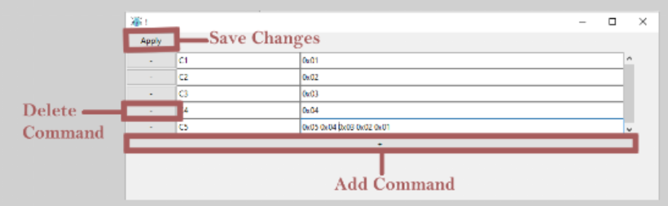

Once you have added all the commands you would like to remove, press "Apply" and your edited commands will be reflected in the command list on the main window. Once you are done editing the command list, close the pop up window.

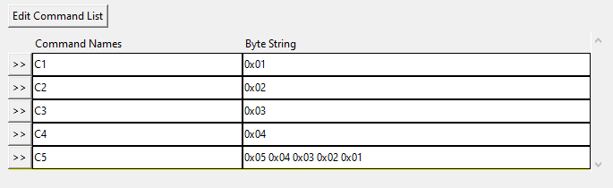

As mentioned previously, you can view serial commands as hex, decimal, or ascii by changing the byte format drop down menu. Doing so will change the commands as they appear in the command list and in the serial transaction log.

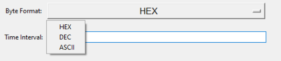

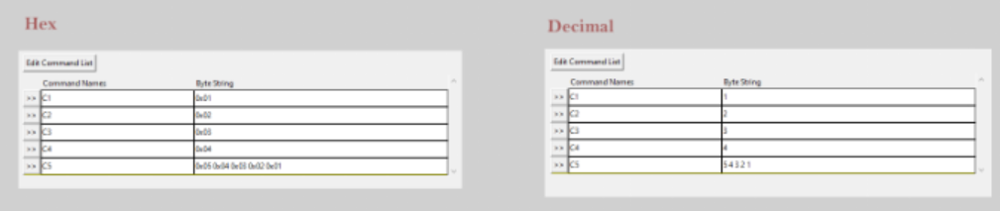

### Profiles:

Serial commands and serial settings are stored in json files called profiles. When deBUGger is opened it reads the last json profile used and displays its serial commands and settings in the GUI.

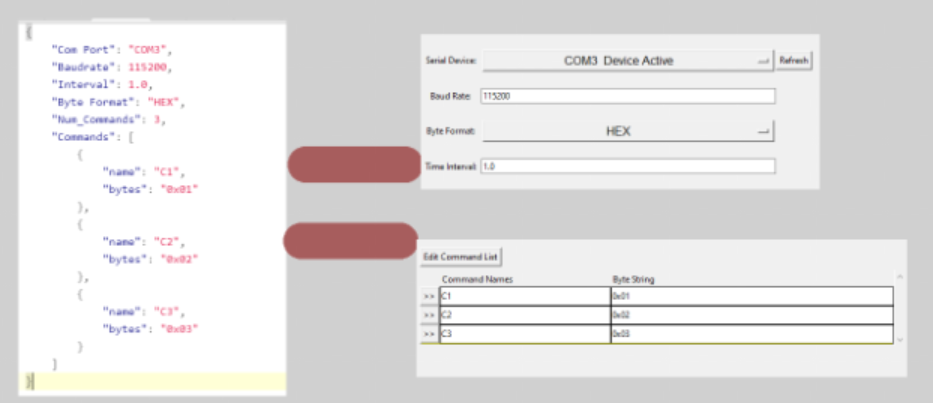

The current profile loaded on deBUGger is shown next to the action buttons.

If you edit the serial command list or serial settings and want to keep these changes in the current profile, press the "save" button in the action section.

Pressing the "save as new profile" button will open a file explore window, allowing you to save your changes as a new json profile.

Finally if you want to swap to a different profile, pressing the "switch profile" button. This will open a file explore window for selecting your active profile.   

### Listen Mode:

If you want to continuously listen for incoming serial bytes, rather than only listening after sending a command, then press the "listen mode" button. Once listen mode is active, all incoming bytes will be displayed on the transaction log. I think the best way to show you how listen mode works it to show it in action with an example.

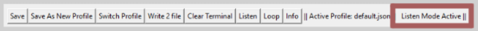

For the listen mode demo, I will a Raspberry Pi 3 as an externa serial device. On this RPi, I haven enabled serial over GPIO pins 14 (TX) and 15 (RX) and used jumpers to attach these pens to same USB to UART bridge from previous examples.

 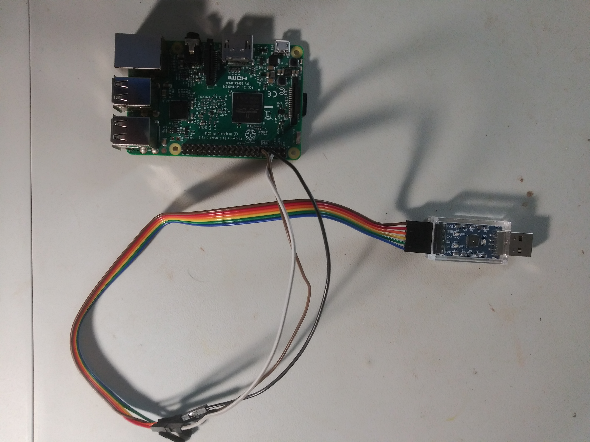

 For the purposes of demonstrating listen mode I have written a short python script on the RPi to send a "test print" message every 10 seconds. The script will also have the RPi send back any bytes it receives over it's RX pin.

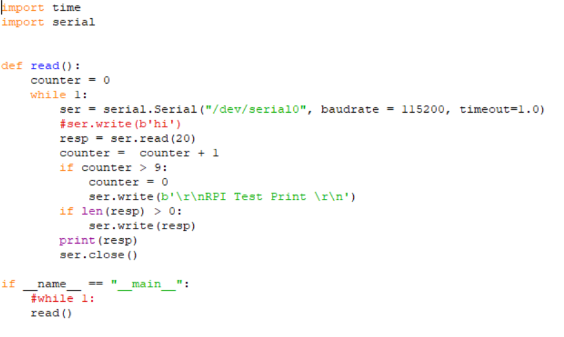

On the deBUGger, I've edited the command list and switched the byte format to ascii.

 When listen mode is active, the message "Listen Mode Active" will be visible above the transaction log. And serial commands sent from the command list can still be sent over serial, but now there is no timeout in listening for a response. Note in the transaction log below, the RPi sends back any commands sent to it and periodically the message "RPI Test Print" is sent to my PC.

 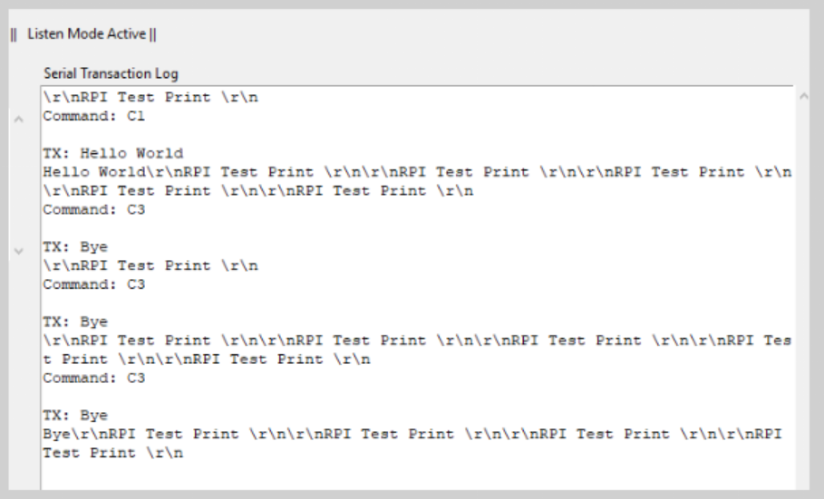

 While in listen mode, you can also send messages that are not in the command list by using the text box and send button at the bottom of the transaction log. Not in the log below, "print check" is sent to the RPi.

 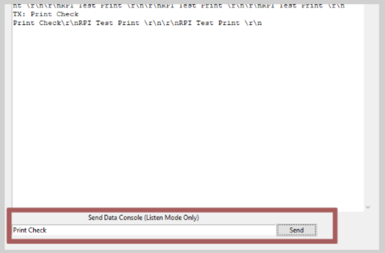

## 4. Modifying the Source Code

This section will describe how you can running the source python files and create your own exe files of the project.

### Setup Requirements:
All the source files are written in Python 3 (I have 3.8.5 installed, but should work on any 3.x.x version)

Library dependences
- tkinter *Standard library, no pip install required*
- json *Standard library, no pip install required*
- threading *Standard library, no pip install required*
- os *Standard library, no pip install required*
- serial *pip install of pyserial is required (my version was 3.4)*
- pyinstaller *pip install of pyinstaller is required (my version was 4.2)*

### Executing the Source Files:
To run the program from the windows command line, open the command line terminal, change directories to the src folder of this repository, and execute the main.py.

 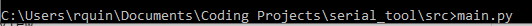

 > depending on how you configured your PC, you may need to write "python main.py" or "python3 main.py"

 Doing so will launch deBUGger GUI. Note that while the GUI is running, debug prints show up on the terminal. The debug prints are from all the python print() statements in the source code. Any prints you add to the code will appear in the terminal.

### Creating EXE file:

To create the sign exe file from the source code I recommend using pyinstaller. First open the command line terminal, change directories to the serial_tool folder (main repo folder) and execute the following command (assuming you have already pip installed pyinstaller).

>your_file_path_to_pyinstaller_lib\pyinstaller --onefile --distpath EXE --name deBUGger --noconsole --icon=Images/Bugger.ico src/main.py

Below is a breakdown of the pyinstaller flags I used to create my EXE.
"--onefile" create a bundled EXE file of the entire python project.
"--distpath <dir_path>" sets destination of EXE file
"--name <output_name>" sets name of output EXE file
"--noconsole" don't provide a terminal for prints, remove this option if you want to see debug prints
"--icon=<icon_file.ico>" setting image of the EXE

When you running the command you will see lots of prints as pyinstaller converts the python script into a windows executable.

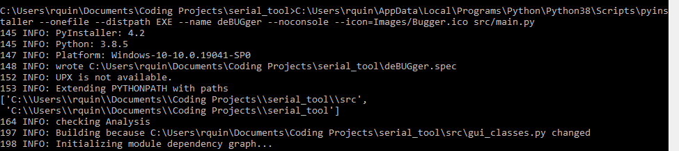

After 30 seconds or so, the prints should stop and at the end you will see "Building EXE from EXE-00.toc completed successfully.", confirming that the EXE was built successfully.

Now you should find your new EXE file in the EXE folder.

### Very High Level Code Overview:

This program consisted of 3 files.
- main.py
- gui_classes.py
- serial_functions.py

#### main.py
 

## 5. Contact Info
Email: rtquinn2@ncsu.edu
