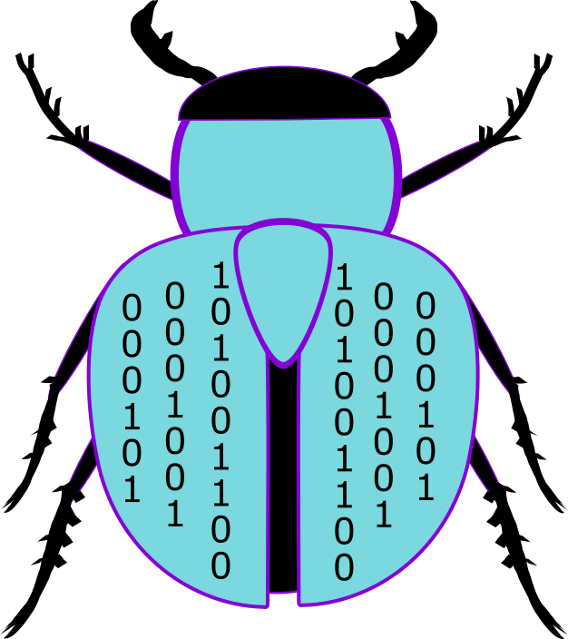

# Serial Tool "deBUGger"
> Open source serial terminal optimized for testing embedded devices

## Table of Contents
1. What is "deBUGger"?
3. Setup Requirements
4. Start Up "deBUGger"
5. Serial Communication
6. Profiles
7. Commands
8. Listen Mode
9. Transaction Window
8. Contact info

## 1. What is "deBUGger"?
Serial is a common method of communication for embedded systems and IOT products from desktop computers. The "deBUGger" GUI removes the repetitive work of setting serial setting and writing data bytes by saving this information into json profiles. Other key features of this program are summarized below.
- Scan for serial devices (COM ports)
- Converting from HEX, DEC, ASCII
- Automatically send all serial command in a list.
- Store serial log to files

# Contact Info
Email: rtquinn2@ncsu.edu
